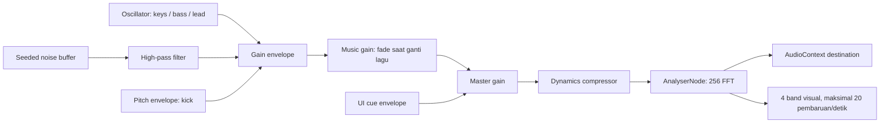

# Audio Portfolio

## 1. Komposisi

**After Hours** dan **Blue Current** adalah dua loop instrumental sintetis yang dibuat untuk portfolio ini. Implementasi berada di `src/audio.ts`, kelas `PortfolioAudio`; UI dan meter ada di `src/SoundDeck.tsx`.

| Lagu | Aransemen |
| --- | --- |
| After Hours | 16 bar, 104 BPM, electric keys pendek, bass sinkopasi, kick, snare, hi-hat, lead. |
| Blue Current | 16 bar, 92 BPM, voicing dan melodi berbeda, keys lebih panjang, beat/lead lebih jarang. |

Keduanya memakai intro tanpa lead selama empat bar dan ruang tanpa lead pada dua bar terakhir. Lagu tidak berganti otomatis ketika pindah halaman. Pilihan melalui native select atau tombol next disimpan sebagai `portfolio-track` (fallback After Hours jika nilainya tidak dikenal).

Tidak ada rekaman OST, sampel audio, atau melodi game yang dibundel. Referensi visual Persona 3 Reload tidak memberikan izin menggunakan soundtrack ATLUS/SEGA. Kredit musik dalam aplikasi menyatakan musik orisinal, bukan OST resmi.

## 2. Jalur Sinyal

Noise dibuat deterministik menggunakan seed lokal, bukan diunduh. Nada dihitung dari MIDI note number. Scheduler berjalan setiap 60 ms dengan look-ahead 180 ms; step adalah not seperenambelas, modulo 256. Oscillator dan buffer source dilepas setelah selesai. Voice aktif dilacak agar pergantian lagu dan pause dapat menghentikan nada yang sudah terjadwal.

Pergantian lagu menurunkan music gain, menghentikan voice lama setelah 80 ms, lalu memulai aransemen baru pada sekitar 100 ms. Hanya satu scheduler aktif; tidak ada context kedua atau unduhan audio. Meter membaca peak bin `[0,4)`, `[4,14)`, `[14,42)`, `[42,128)` dari analyser setelah compressor. Ini indikator level relatif, bukan alat ukur dB terkalibrasi.

## 3. Kontrol dan Lifecycle

| Keadaan | Perilaku |
| --- | --- |
| Halaman baru / reload | Senyap; belum membuat `AudioContext`. |
| Klik speaker / tombol musik di kredit | Membuat atau melanjutkan context setelah gestur pengguna. |
| Volume | Default 30%, rentang 0-100; `portfolio-volume` di localStorage. |
| Mute | Menghentikan scheduler/voice, menurunkan master gain; context dan step dipertahankan. |
| Tab tersembunyi | Musik dijeda. |
| Tab kembali | Melanjutkan step berikutnya jika pilihan putar masih aktif; tidak mengejar durasi tab tersembunyi. |
| Ganti lagu saat senyap | Simpan pilihan; tidak membuat context atau autoplay. |
| Ganti lagu saat putar | Fade singkat, hentikan voice lama, reset step lagu baru; volume tetap. |
| Komponen dilepas | Timer berhenti, `AudioContext` ditutup. |
| Browser menolak audio | Status kesalahan tersedia; navigasi tetap berfungsi. |

Status putar tidak disimpan. Volume 0 tidak sama dengan mute: scheduler tetap aktif tetapi gain nol. Tombol animasi terpisah dari audio. Reduced motion menghentikan gerak visual, bukan mengubah pilihan musik pengguna. Meter berhenti dan kembali datar ketika muted, motion off, atau tab tersembunyi; pada volume 0 nilainya juga datar. Tidak ada animasi equalizer palsu.

Cue `select`, `confirm`, dan `back` berbunyi hanya ketika audio aktif. Batas 65 ms mencegah cue bertumpuk akibat input cepat. Generation counter melindungi pergantian cepat antara start, pause, dan dispose selama `resume()` belum selesai. Klik kedua saat consent masih pending membatalkan permintaan pertama; hasil async lama tidak menyalakan status kembali.

## 4. Perubahan dan Pengujian

1. Ubah chord, melody, instrument envelope, atau pola beat pada `schedule()` secara sengaja; jangan memasukkan melodi pihak ketiga tanpa izin.
2. Pertahankan jalur persetujuan pengguna, mute, volume, cleanup, dan penanganan tab tersembunyi.
3. Jalankan `npm test`; tes memeriksa context belum dibuat sebelum klik, kedua lagu menghasilkan sampel, satu context saat ganti cepat, meter mengikuti volume, gain turun setelah mute, tab hidden/resume, kegagalan dan retry, consent pending dibatalkan, preferensi tersimpan, reload senyap.
4. Dengarkan manual pada speaker dan headphone dengan volume awal rendah. Tes sampel membuktikan keluaran sinyal, bukan kualitas musikal atau kenyamanan pendengaran.

Tidak ada dependensi file MP3 atau layanan musik eksternal. Dukungan dan kebijakan Web Audio tetap bergantung browser; tes otomatis menggunakan Chromium, bukan seluruh browser/perangkat audio.
