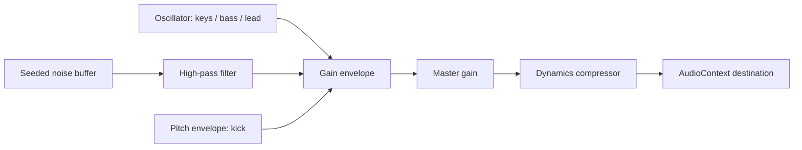

# Audio Portfolio

## 1. Komposisi

**After Hours** adalah loop instrumental sintetis yang dibuat untuk portfolio ini: 16 bar, 104 BPM, electric keys, bass sinkopasi, kick, snare, hi-hat, dan lead. Implementasi berada di `src/audio.ts`, kelas `PortfolioAudio`.

Tidak ada rekaman OST, sampel audio, atau melodi game yang dibundel. Referensi visual Persona 3 Reload tidak memberikan izin menggunakan soundtrack ATLUS/SEGA. Kredit musik dalam aplikasi menyatakan musik orisinal, bukan OST resmi.

## 2. Jalur Sinyal

Noise dibuat deterministik menggunakan seed lokal, bukan diunduh. Nada dihitung dari MIDI note number. Scheduler berjalan setiap 60 ms dengan look-ahead 180 ms; step adalah not seperenambelas. Oscillator dan buffer source dilepas setelah selesai.

## 3. Kontrol dan Lifecycle

| Keadaan | Perilaku |
| --- | --- |
| Halaman baru / reload | Senyap; belum membuat `AudioContext`. |
| Klik speaker / tombol musik di kredit | Membuat atau melanjutkan context setelah gestur pengguna. |
| Volume | Default 30%, rentang 0-100; `portfolio-volume` di localStorage. |
| Mute | Menghentikan scheduler, menurunkan master gain; context dipertahankan untuk penggunaan berikutnya. |
| Tab tersembunyi | Musik dijeda. |
| Tab kembali | Mulai lagi dari awal loop jika pilihan putar masih aktif. |
| Komponen dilepas | Timer berhenti, `AudioContext` ditutup. |
| Browser menolak audio | Status kesalahan tersedia; navigasi tetap berfungsi. |

Status putar tidak disimpan. Volume 0 tidak sama dengan mute: scheduler tetap aktif tetapi gain nol. Tombol animasi terpisah dari audio. Reduced motion menghentikan gerak visual, bukan mengubah pilihan musik pengguna.

Cue `select`, `confirm`, dan `back` berbunyi hanya ketika audio aktif. Batas 65 ms mencegah cue bertumpuk akibat input cepat. Generation counter melindungi pergantian cepat antara start, pause, dan dispose selama `resume()` belum selesai.

## 4. Perubahan dan Pengujian

1. Ubah chord, melody, instrument envelope, atau pola beat pada `schedule()` secara sengaja; jangan memasukkan melodi pihak ketiga tanpa izin.
2. Pertahankan jalur persetujuan pengguna, mute, volume, cleanup, dan penanganan tab tersembunyi.
3. Jalankan `npm test`; tes memeriksa context belum dibuat sebelum klik, sampel audio bukan nol setelah play, gain turun setelah mute, volume tersimpan, reload kembali senyap.
4. Dengarkan manual pada speaker dan headphone dengan volume awal rendah. Tes sampel membuktikan keluaran sinyal, bukan kualitas musikal atau kenyamanan pendengaran.

Tidak ada dependensi file MP3 atau layanan musik eksternal. Dukungan dan kebijakan Web Audio tetap bergantung browser; tes otomatis menggunakan Chromium, bukan seluruh browser/perangkat audio.
