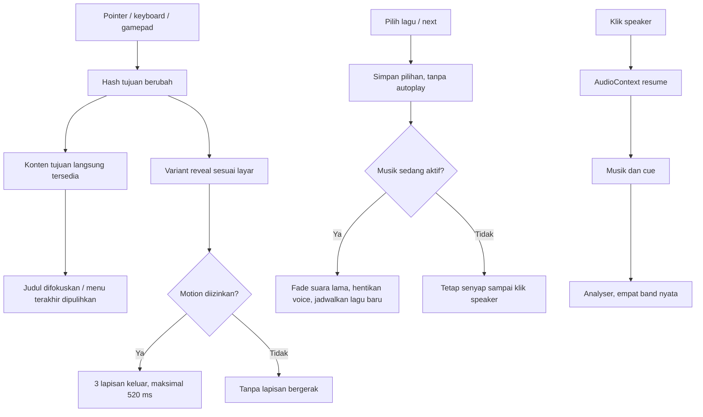

# Penyempurnaan Persona dan Review Anti-Slop

Tanggal: 28 September 2026. Status deployment dan tes: [STATUS.md](STATUS.md).

## 1. Tujuan

Pertahankan menu Persona, portrait pemilik, dan bukti profesional. Perkuat respons pilihan, hubungan antarhalaman, serta audio tanpa menambah hambatan untuk HR. "AI slop" di sini berarti keputusan generik atau tidak terawat: template kartu berulang, statistik rekaan, efek tanpa fungsi, gerak yang mengganggu, teks kosong, dan kontrol semu. Ini bukan metode mendeteksi siapa yang menulis kode, bukan janji bahwa orang tidak akan menganggap website dibuat dengan AI.

## 2. Sumber yang Dibaca

| Sumber | Temuan | Batas penggunaan |
| --- | --- | --- |
| [blairxu13/persona3-website](https://github.com/blairxu13/persona3-website/tree/31d3f5521cdfa7cd3ca1b8422038404dfb8bc779) | `P3Menu.jsx`: tipografi miring, mask pilihan, shadow berlapis, stagger. `PageTransition.jsx`: wipe berbeda per rute. `AboutMe.jsx`: daftar seleksi dan detail. `App.jsx`/`VideoPage.jsx`: video autoplay dengan `muted`. | Source dibaca sebagai referensi. Repository tidak menyatakan lisensi saat diperiksa. Tidak menyalin source, karakter, video, atau musik. Repo tidak dijalankan secara lokal. |
| [Nutlope/hallmark](https://github.com/Nutlope/hallmark) | [Slop test](https://github.com/Nutlope/hallmark/blob/main/skills/hallmark/references/slop-test.md): hierarki, spesifisitas, restraint, kontrol yang nyata. [Motion](https://github.com/Nutlope/hallmark/blob/main/skills/hallmark/references/motion.md): satu urutan terarah, transform/opacity, reduced motion. | Referensi kritik, tidak diinstal sebagai skill/dependensi. Larangan estetika tidak diterapkan membabi buta pada brief Persona. |
| [Gesso-Build/skills](https://github.com/Gesso-Build/skills) | README mendefinisikan gejala seperti nested cards, visualisasi palsu, placeholder, animasi properti layout, `transition: all`. | CLI tidak dijalankan; tidak ada klaim sertifikat/skor anti-slop. Detektornya membaca HTML, bukan TSX langsung. |
| [Wawancara UI Persona 3 Reload](https://personacentral.com/p3r-interview-menu-ui/) | Gerak air, refleksi, komposisi protagonis. | Konteks art direction; bukan spesifikasi durasi game. |

Pada repo blairxu13, tidak ditemukan berkas audio terpisah dalam tree yang diperiksa. Video menu dan `VideoPage` memakai `muted`; referensi tersebut bukan bukti soundtrack boleh diambil. Video `main1.mp4` sekitar 28,6 MB. Portfolio tidak memerlukan payload itu untuk menerapkan bahasa transisinya.

## 3. Keputusan Implementasi

| Sebelum | Sekarang | Alasan |
| --- | --- | --- |
| Satu slash untuk semua layar. | Profile: diagonal portrait reveal. Work/Experience: tiga baris dossier. Skills/Contact/Credits: tiga strip vertikal. Menu: arah kembali ke kiri. | Kelompok informasi punya gerak masuk yang konsisten, arah kembali mudah dikenali. |
| Seluruh menu masuk bersamaan. | Enam pilihan masuk berselang 35 ms, selesai kurang dari 500 ms; panah aktif bergerak 7 px selama 160 ms. | Pilihan terbaca berurutan, perubahan fokus tetap langsung. |
| Detail berada dalam panel bershadow, daftar proyek seperti kartu di dalamnya. | Bidang baca penuh tanpa shadow, proyek sebagai baris bergaris, pengalaman memakai potongan diagonal seleksi. | Kurangi frame bertumpuk, pertahankan karakter menu tanpa mengorbankan teks panjang. |
| Equalizer bergerak berdasarkan CSS tanpa membaca musik. | Empat band membaca `AnalyserNode` sesudah compressor, maksimum 20 pembaruan/detik. | Indikator sesuai keluaran, kembali datar ketika senyap atau animasi dimatikan. |
| Satu musik dan restart dari awal setelah pause. | After Hours 104 BPM dan Blue Current 92 BPM; pilihan lagu, tombol berikutnya, fade singkat; pause melanjutkan step tersimpan. | Variasi ritme tanpa layanan eksternal; musik tidak bergantung perpindahan layar. |

Semua motion baru memakai transform/translate dan opacity. Tidak ada timer untuk menahan navigasi, custom cursor, parallax konten, toast selebrasi, progress palsu, atau autoplay audio. Isi tidak disembunyikan menunggu scroll. Transisi maksimal 520 ms termasuk stagger; lapisan `pointer-events: none`, `aria-hidden`, tidak mengambil fokus. Klik cepat mengganti elemen transisi melalui key rute, bukan antrean animasi.

## 4. Yang Sengaja Tetap

- Dashboard tetap memakai `ricko-portrait-menu.webp` 354 x 1246, crop setengah wajah dan komposisi yang disetujui. Aturan posisi portrait tidak diubah.
- Profile tetap memakai seluruh sumber `ricko-portrait.webp` 853 x 1280 dengan `contain`, bukan crop baru.
- Logo RP, CV asli, data karier, sembilan proyek, tujuh foto bukti, dan penghapusan CyberArk tidak berubah.
- CV tetap byte-identik dengan dokumen pemilik; SHA-256 `55adb186dd0f648b029d313da3438dd31f8772ebf95b5038fa7263e956602347`.
- EN/ID, hash/history, deep link, keyboard/gamepad, fokus dialog, reduced motion, pause, WebGL fallback, serta `?classic` tetap tersedia.
- Biru dominan dan tipografi miring adalah keputusan Persona yang diminta pemilik, bukan warna default template. Bidang baca terang dan foto autentik tetap memberi pemisahan visual.

## 5. Alur Baru

## 6. Cara Mengembangkan

1. Pemetaan layar berada di `src/ScreenTransition.tsx`; geometri/timing di blok transisi `src/persona.css`. Pertahankan maksimum sekitar setengah detik, tanpa blocking state.
2. Tambah musik melalui `soundtracks` dan aransemen `src/audio.ts`. `SoundDeck.tsx` membaca katalog tersebut. Beri kredit dan bukti lisensi jika suatu hari menggunakan rekaman eksternal.
3. Jangan mengubah fakta atau menambah angka agar lebih menyerupai RPG. Hubungkan setiap klaim baru ke CV/bukti, bukan ke kebutuhan layout.
4. Periksa screenshot menu/detail/transisi, font, geometri 320 px sampai desktop lebar, kedua bahasa, keyboard, gerak cepat, audio gagal, dan reduced motion. Dengarkan musik secara manual pada volume rendah.
5. Jalankan seluruh tes, build, audit; verifikasi CV hash; perbarui dokumen; deploy dan tes URL publik. Detail pada [IMPLEMENTATION.md](IMPLEMENTATION.md) dan [DEPLOYMENT.md](DEPLOYMENT.md).

## 7. Batas Review

Screenshot Playwright dibuat untuk desktop/mobile, termasuk frame tengah transisi. Alat penampil gambar pada sesi ini tidak mengembalikan gambar yang dapat ditinjau; jangan membaca tes geometri/pixel sebagai inspeksi estetika manual. Tes audio memeriksa sinyal dan lifecycle, bukan kualitas musikal. Review visual dan pendengaran pemilik tetap diperlukan. Tidak ada klaim pixel-identik dengan game, tidak ada audit seluruh rule dari repo anti-slop, dan tidak ada dependensi baru.
