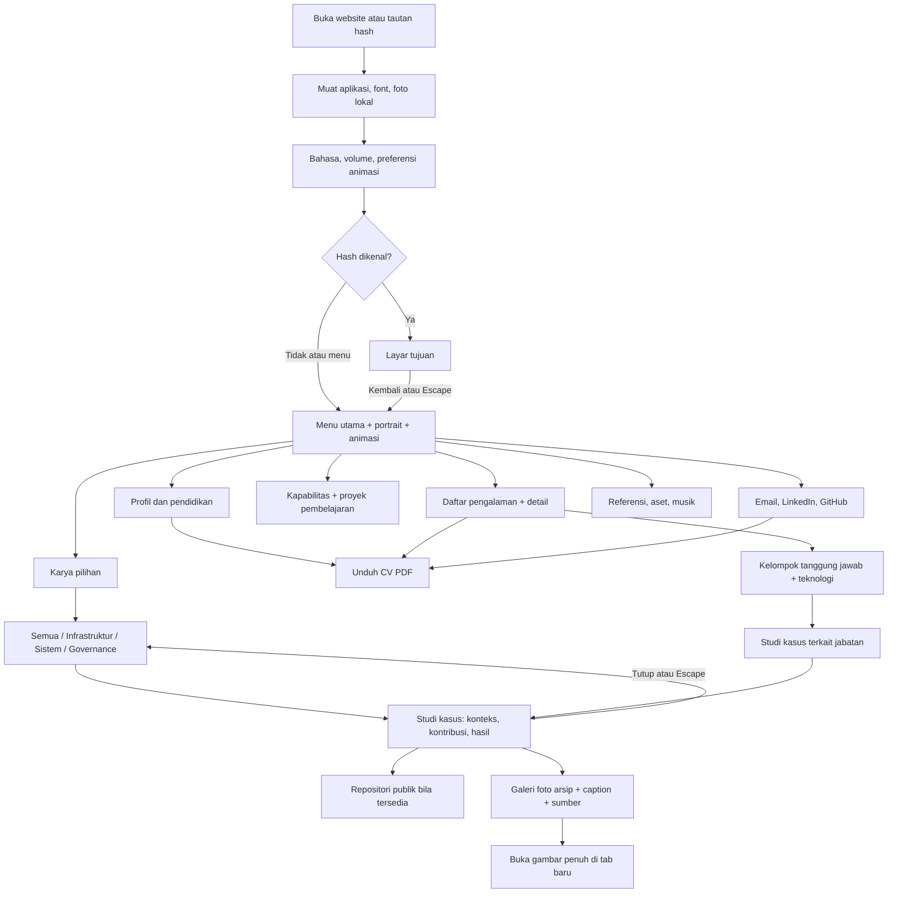
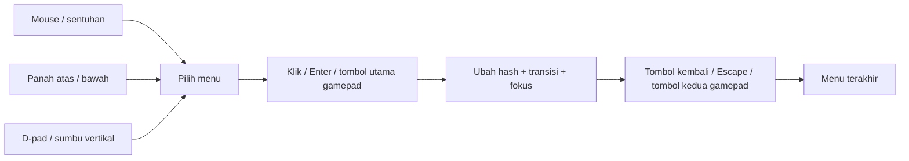
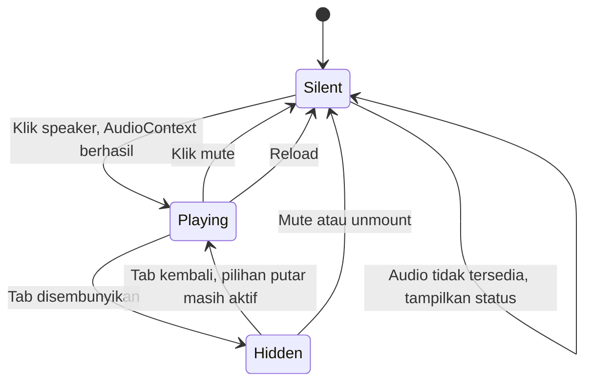
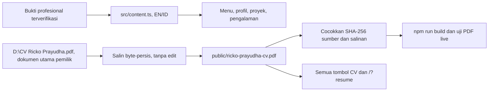
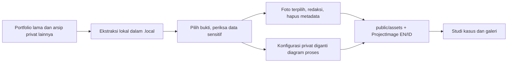
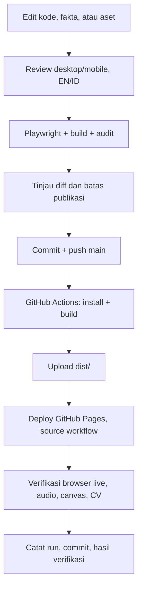

# Alur Portfolio

Alur berikut menggambarkan implementasi menu baru. Struktur kode: [IMPLEMENTATION.md](IMPLEMENTATION.md). Detail musik: [AUDIO.md](AUDIO.md).

## 1. Pengunjung

CV selalu tersedia dari header. Studi kasus menggunakan dialog HTML dengan fokus terkelola. Tombol berikutnya berpindah antarbagian; tombol kembali membuka menu. Browser Back/Forward mengikuti riwayat hash. Tidak ada login atau halaman pembuka yang menghalangi akses HR.

Dialog dapat dibuka dari karya maupun pengalaman. Escape mengembalikan fokus ke pemicu tanpa keluar dari layar asal. Galeri kembali ke foto pertama ketika proyek dibuka ulang; thumbnail dan tombol panah mengubah foto tanpa mengubah URL.

## 2. Rute dan State

| URL | Tampilan |
| --- | --- |
| `/` atau `/#menu` | Menu utama. Hash tidak dikenal juga menampilkan menu. |
| `/#profile` | Profil. |
| `/#work` | Studi kasus. |
| `/#experience` | Pengalaman. |
| `/#skills` | Kapabilitas. |
| `/#contact` | Kontak. |
| `/#credits` | Referensi dan atribusi. |
| `/?classic` | Portfolio scrolling versi awal. |
| `/?resume` | Tautan lama; langsung membuka PDF CV asli. |

Hash bukan path server: refresh langsung pada `/#work` tetap meminta `/` kepada GitHub Pages, sehingga tidak memerlukan rewrite SPA.

| State | Sumber | Persistensi |
| --- | --- | --- |
| Layar | Hash URL | Bookmark dan history. |
| Menu terpilih | Pointer, fokus, keyboard, gamepad | Selama sesi React. |
| Bahasa | `portfolio-language` | localStorage, default EN. |
| Animasi | `portfolio-motion` atau preferensi OS | Pilihan manual tersimpan; tanpa pilihan manual mengikuti OS. |
| Volume | `portfolio-volume` | localStorage, default 30%. |
| Musik aktif | Klik speaker | Tidak disimpan; reload selalu senyap. |
| Filter, studi kasus, pengalaman | Interaksi komponen | Tidak disimpan dalam URL/storage. |
| Status salin email | Clipboard API | Hilang setelah 3,5 detik. |

Kegagalan localStorage tidak menghalangi aplikasi. Pergantian hash menutup dialog. Pergantian layar mengembalikan scroll ke atas dan memindahkan fokus ke judul; kembali ke menu memulihkan fokus pilihan. Skip link memindahkan fokus tanpa mengubah hash. Di ponsel/tablet, memilih pengalaman memfokuskan detail supaya perubahan langsung terlihat.

## 3. Input

Keyboard panah hanya ditangani saat fokus berada pada menu atau body; kontrol volume tidak direbut. Escape pada dialog menutup dialog dahulu, tidak sekaligus keluar dari layar karya. Gamepad pada layar detail menelusuri tombol/tautan; dukungan bergantung pemetaan controller browser.

## 4. Audio dan Animasi

Volume mengendalikan musik dan suara UI. Musik tidak menentukan navigasi: seluruh konten tetap tersedia ketika audio gagal. Menonaktifkan animasi menghentikan shader, portrait, equalizer, dan transisi, tanpa mematikan musik. Three.js menggunakan fallback CSS ketika WebGL tidak tersedia. RAF dan jadwal audio berhenti ketika tab disembunyikan; sumber daya dibersihkan saat unmount.

## 5. Konten dan CV

Konten website di `src/content.ts` terpisah dari CV asli. Mengubah konten website tidak mengubah PDF. Hanya ganti salinan publik jika pemilik menyediakan versi baru dokumen utama; jangan memodifikasi isi CV melalui kode atau generator.

Pengecualian: CV utama yang diminta pemilik untuk dipublikasikan disalin ke `public/`, termasuk informasi kontak di dalamnya. PDF arsip lain dan hasil OCR privat tetap di luar repo. Panduan rinci: [EVIDENCE.md](EVIDENCE.md).

## 6. Rilis

Detail pemulihan dan rollback: [DEPLOYMENT.md](DEPLOYMENT.md). Lulus pengujian otomatis tidak berarti desain identik dengan game atau semua perangkat telah diuji.
